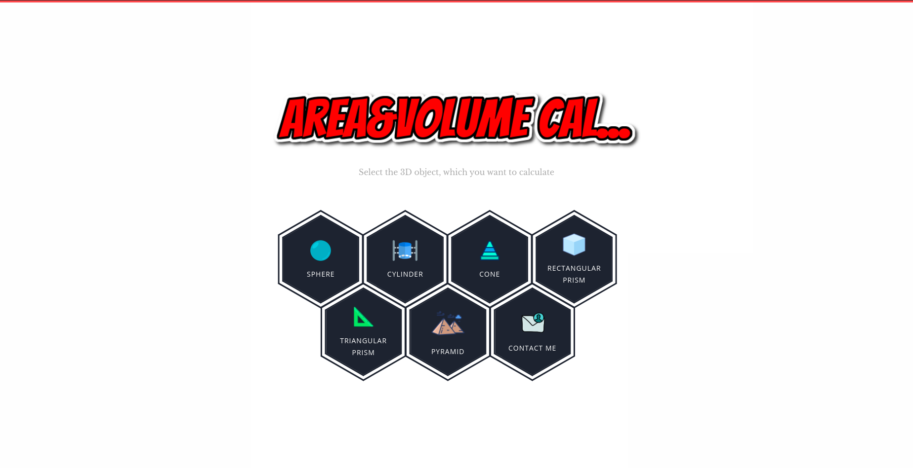
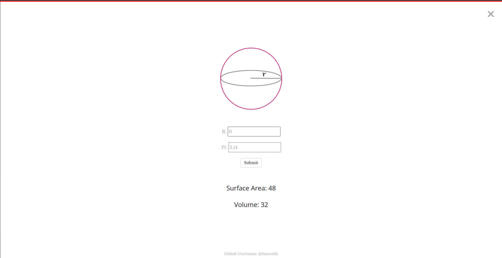

# Area and Volume Calculation with Django Website

- This website can calculation area and volume some 3D objects
- Django version: 3.2.9
- All Bootstrap and other files (css,scss,js and images) in static folder

## HomePage:

There are 6 3D objects in this webiste :
- Sphere
- Cylinder
- Cone
- Rectangular Prism
- Triangular Prism
- Pyramid

## Example; Sphere Page:

## Contact
If you have any question, please send an email: abhmtcelik@gmail.com
